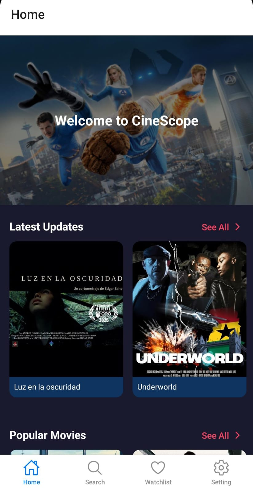
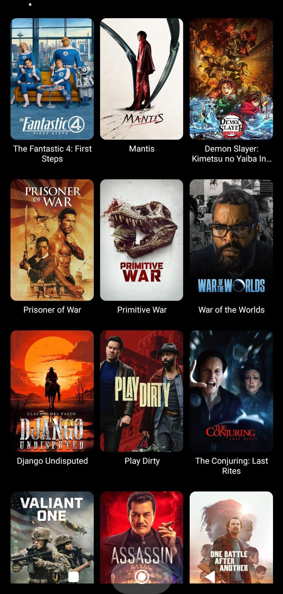
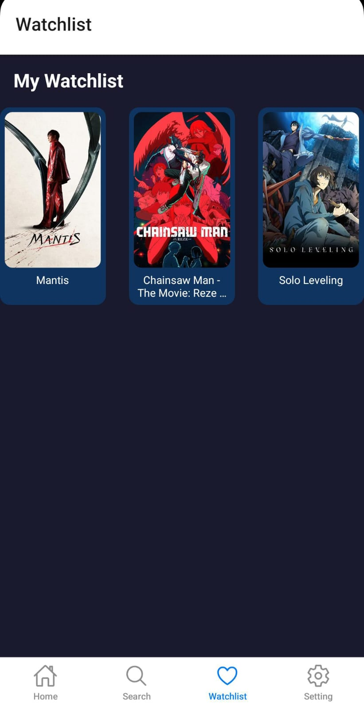

# 🎬 CineScope  

CineScope is a **React Native mobile application** that brings the world of movies and TV shows to your fingertips.  
It uses the **TMDB API** to fetch trending, popular, and latest content with a clean and modern UI powered by **Expo Router**, **NativeWind**, and **React Native Reanimated**.  

---

## 🚀 Features  

- 🔑 **Authentication Flow** (Login, Register, Logout)  
- 🏠 **Dashboard** with trending & popular movies/TV shows  
- 🎞️ **Movie & TV Show Details** with overview, rating, and poster  
- ❤️ **Watchlist** (add/remove movies & TV shows)  
- 🔎 **Search** movies & TV shows by title  
- 🌐 **Category & Genre Filtering**  
- 🎠 **Interactive Sliders & Animations** with `react-native-reanimated`    

---

## 🛠️ Tech Stack  

- **React Native** (Expo SDK 51)  
- **Expo Router** – file-based routing  
- **NativeWind** – TailwindCSS for styling  
- **React Native Reanimated** – animations  
- **Lucide React Native** – icons  
- **AsyncStorage** – local storage for watchlist & session  
- **TMDB API** – movie & TV data  

---

## 📸 Screenshots  

| Home | See All | Watchlist |
|------|--------------|-----------|
|  |  |  |

---

## 🎥 Demo Video  

Watch CineScope in action!   
[Demo Video Link](https://youtu.be/f535e5oWcvA)

---

## 📱 Download APK  

You can try out CineScope on your Android device by downloading the APK:  

👉 [Download CineScope APK](https://drive.google.com/file/d/1m-iub1FfM4ggpQoIFB_5pKO1mlk_mHCf/view?usp=drive_link)

---

## 🔑 API

This project uses the TMDB API.
You need to create a free account and generate an API key to use the app.

---

## 🚀 Getting Started

1. Clone the repo

git clone https://github.com/nawodahansani/CineScope-Mobile-App.git

2. Install dependencies

npm install
# or
yarn install

3. Configure Environment Variables

TMDB_API_KEY=your_tmdb_api_key_here
BASE_URL=https://api.themoviedb.org/3

4. Run the app

npx expo start

